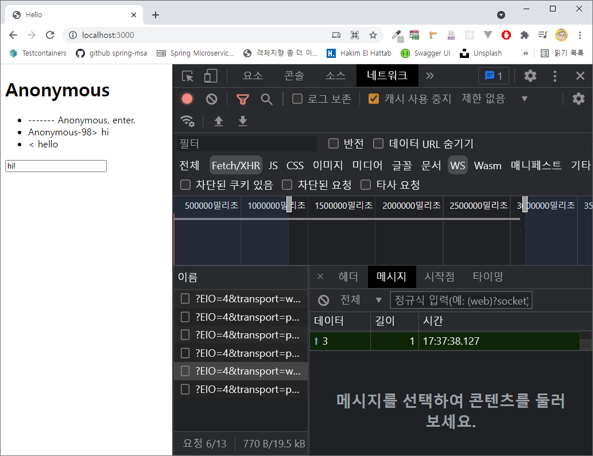

# Chatting App
채팅 앱을 만들어 볼거래요.

## MVC  Pattern, Project setup
MVC Pattern. 뻔하죠. 익히 알고 있는거잖아요. **관심사의 분리** 가 이유인거죠.

## WebSocket
WebSocket 을 이용해요. 특별할 건 없어요. Stateless 한 HTTP 에서 stateful 하게 하려면 polling 등의 방식을
사용해야 하는데, 그러면 부하가 많이 걸린다죠. 그래서 생겨난거죠.
[WebSocket과 Socket.io](https://d2.naver.com/helloworld/1336) 라는 Naver D2 포스팅을 보면 도움이 될 거 같아요.
10년 전 글인데, 훌륭하네요.

```shell
npm i -S @nestjs/websockets @nestjs/platform-socket.io
```

이렇게 모듈을 추가 하면 돼요.
```js
// <script src="https://cdn.socket.io/4.2.0/socket.io.min.js"></script>

const socket = io('/')

// receive
socket
.on('topic_id1', 'message #1')
.on('topic_id2', 'message #2')

// send
socket.emit('topic_id1', 'Get a message!')
```

이렇게 구현하면 하면 돼요.


이런식으로 개발자도구의 네트워크 탭을 확인할 때, 뭔가 데이터가 In/Out 되는게 나타나게 돼요.

```ts
// chats.gateway.ts

@SubscribeMessage('enter')
async entered(
  @MessageBody() username: string,
  @ConnectedSocket() socket: Socket
) {
  const exists = await this.socketModel.exists({ username })
  if (exists) {
    username = `${username}-${Math.floor(Math.random() * 100)}`
  }

  await this.socketModel.create({
    id: socket.id,
    username
  })

  socket.emit('enter', `------- ${username}, enter.`)
}
```
서버에서 `@SubscribeMessage(...)` 데코레이터를 이용해서 토픽(여기선 `enter`)를 정하면, 브라우저에서 보낸(emit) 메세지를
받을 수 있어요. 브라우저에서 사용하던 socket.io 의 api 그대로 `socket.emit(topic_id, message)` 서버 api 로 다시
브라우저에 보내(emit)는 거죠.

> **broadcasting**  
> 네트워크 개념 중에 모두에게 다 뿌리는 방식을 얘기하는데,
> 채팅 앱을 생각해보면 내가 쓰는 대화가 대화방에 있는 모두에게 전파돼야 하잖아요.
> 서버는 `socket.broadcast.emit(topic_id, message)` 를 사용하면 돼요.

## Database
MongoDB 연결하는 model 들은 특별할게 없어요.  
코드 내에 `*.model.ts` 를 내용을 확인해보면

```ts
  @Prop({
    type: {
      _id: { type: Types.ObjectId, required: true, ref: 'socket' },
      id: { type: String },
      username: { type: String, required: true }
    }
  })
  @IsNotEmpty()
  @IsObject()
  own: Socket
```
primitive type 이 아닌 우리가 정의한 reference type 을 다음과 같이 정의 해요.

## handlebars
```shell
npm i -S hbs
```
view 용 template engine 을 handlebars 를 쓰네요.

## conclusion
WebSocket 을 활용한 채팅 앱이에요. 간단히 작성해 봤네요.
오늘도 끝~ :)
